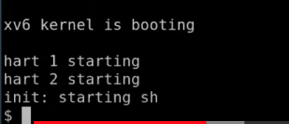
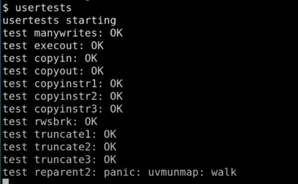
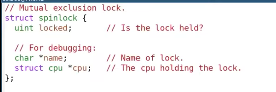
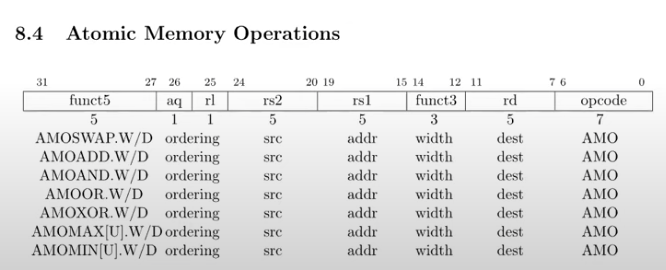

# 阅读第六章

**并发**指的是由于多处理器并行、线程切换或中断而导致多个指令流交错的情况。

以并发下的正确性为目标的策略，以及支持这些策略的抽象，被称为**并发控制技术**。

一种并发控制技术：**锁**。锁提供了相互排斥的功能，确保一次只有一个 CPU 可以持有锁。

## Race conditions

竞争条件是指同时访问一个内存位置，并且**至少有一次访问是写**的情况。

避免竞争的通常方法是使用锁。锁确保了相互排斥。

锁将并发的临界区串行化。由锁保护的临界区是原子的，每个临界区只能看到之前临界区的完整变化，不会看到部分完成的更新。

## Code: Locks

原子操作：在RISC V 上，这条指令是 amoswap r, a，将寄存器 r 的内容和内存地址 a 的内容进行了交换。

## Code:Using locks

## Deadlock and lock ordering

一组进程中的每个进程都在等待另一个进程释放所占有的资源，比如锁，就构成了死锁。

为了避免死锁，这里给出一种预防死锁的方式：按照一定的顺序获取资源，即破坏循环等待条件。

## Locks and interrupt handlers

## Instruction and memory ordering

CPU和编译器会改变源代码顺序。

## Sleep locks

# 为什么要使用锁？

今天的课程的内容是锁。这节课偏向于理论介绍，并且或许会与其他课程中有关锁的内容有些重合，不过这节课更关注在内核和操作系统中使用的锁。

首先，我们来看一下为什么我们需要锁？故事要从应用程序想要使用多个CPU核开始。使用多个CPU核可以带来性能的提升，如果一个应用程序运行在多个CPU核上，并且执行了系统调用，那么内核需要能够处理并行的系统调用。如果系统调用并行的运行在多个CPU核上，那么它们可能会并行的访问内核中共享的数据结构。到目前为止，你们也看到了XV6有很多共享的数据结构，例如proc、ticks和我们之后会看到的buffer cache等等。当并行的访问数据结构时，例如一个核在读取数据，另一个核在写入数据，我们需要使用锁来协调对于共享数据的更新，以确保数据的一致性。所以，我们需要锁来控制并确保共享的数据是正确的。

但是实际的情况有些令人失望，因为我们想要通过并行来获得高性能，我们想要并行的在不同的CPU核上执行系统调用，但是如果这些系统调用使用了共享的数据，我们又需要使用锁，而锁又会使得这些系统调用串行执行，所以最后锁反过来又限制了性能。

所以现在我们处于一个矛盾的处境，出于正确性，我们需要使用锁，但是考虑到性能，锁又是极不好的。这就是现实，我们接下来会看看如何改善这个处境。

以上是一个大概的介绍，但是回到最开始，为什么应用程序一定要使用多个CPU核来提升性能呢？这个实际上与过去几十年技术的发展有关，下面这张非常经典的图可以解释为什么。

这张图有点复杂，X轴是时间，Y轴是单位，Y轴具体意义取决于特定的曲线。这张图中的核心点是，大概从2000年开始：

- CPU的时钟频率就没有再增加过了（绿线）。
- 这样的结果是，CPU的单线程性能达到了一个极限并且也没有再增加过（蓝线）。
- 但是另一方面，CPU中的晶体管数量在持续的增加 （深红色线）。
- 所以现在不能通过使用单核来让代码运行的更快，要想运行的更快，唯一的选择就是使用多个CPU核。所以从2000年开始，处理器上核的数量开始在增加（黑线）。

所以现在如果一个应用程序想要提升性能，它不能只依赖单核，必须要依赖于多核。这也意味着，如果应用程序与内核交互的较为紧密，那么操作系统也需要高效的在多个CPU核上运行。这就是我们对内核并行的运行在多个CPU核上感兴趣的直接原因。你们可能之前已经看过上面这张图，但我们这里回顾一下背景知识也是极好的。

那为什么要使用锁呢？前面我们已经提到了，是为了确保正确性。当一份共享数据同时被读写时，如果没有锁的话，可能会出现race condition，进而导致程序出错。race condition是比较讨厌的，我们先来看看什么是race condition。我们接下来会在XV6中创建一个race condition，然后看看它的表象是什么。

kalloc.c文件中的kfree函数会将释放的page保存于freelist中。

freelist是XV6中的一个非常简单的数据结构，它会将所有的可用的内存page保存于一个列表中。这样当kalloc函数需要一个内存page时，它可以从freelist中获取。从函数中可以看出，这里有一个锁kmem.lock，在加锁的区间内，代码更新了freelist。现在我们将锁的acquire和release注释上，这样原来在上锁区间内的代码就不再受锁保护，并且不再是原子执行的。

之后运行make qemu重新编译XV6，

我们可以看到XV6已经运行起来，并且我们应该已经运行了一些对于kfree的调用，看起来一切运行都正常啊。

接下来运行一下usertest，究竟能不能成功呢？有人想猜一下吗？

> 学生回答：如果发生了race condition就会丢失一些内存page，如果没有发生就能成功。

是的，race condition不一定会发生，让我们来运行一下usertest，看看究竟会发生什么。我这里通过qemu模拟了3个CPU核，这3个核是并行运行的。但是如刚刚那位同学指出的，race condition不一定会发生，因为当每一个核在每一次调用kfree函数时，对于freelist的更新都还是原子操作，这与有锁是一样，这个时候没有问题。有问题的是，当两个处理器上的两个线程同时调用kfree，并且交错执行更新freelist的代码。

我们来看一下usertest运行的结果，可以看到已经有panic了。所以的确有一些race condition触发了panic。但是如前面的同学提到的，还有一些其他的race condition会导致丢失内存page，这种情况下，usertest运行并不会有问题。

所以race condition可以有不同的表现形式，并且它可能发生，也可能不发生。但是在这里的usertests中，很明显发生了什么。

# 锁如何避免race condition？

首先你们在脑海里应该有多个CPU核在运行，比如说CPU0在运行指令，CPU1也在运行指令，这两个CPU核都连接到同一个内存上。在前面的代码中，数据freelist位于内存中，它里面记录了2个内存page。假设两个CPU核在相同的时间调用kfree。

kfree函数接收一个物理地址pa作为参数，freelist是个单链表，kfree中将pa作为单链表的新的head节点，并更新freelist指向pa（注，也就是将空闲的内存page加在单链表的头部）。当两个CPU都调用kfree时，CPU0想要释放一个page，CPU1也想要释放一个page，现在这两个page都需要加到freelist中。

kfree中首先将对应内存page的变量r指向了当前的freelist（也就是单链表当前的head节点）。我们假设CPU0先运行，那么CPU0会将它的变量r的next指向当前的freelist。如果CPU1在同一时间运行，它可能在CPU0运行第二条指令（kmem.freelist = r）之前运行代码。所以它也会完成相同的事情，它会将自己的变量r的next指向当前的freelist。现在两个物理page对应的变量r都指向了同一个freelist（注，也就是原来单链表的head节点）。

接下来，剩下的代码也会并行的执行（kmem.freelist = r），这行代码会更新freelist为r。因为我们这里只有一个内存，所以总是有一个CPU会先执行，另一个后执行。我们假设CPU0先执行，那么freelist会等于CPU0的变量r。之后CPU1再执行，它又会将freelist更新为CPU1的变量r。这样的结果是，我们丢失了CPU0对应的page。CPU0想要释放的内存page最终没有出现在freelist数据中。

这是一种具体的坏的结果，当然可能会有更多坏的结果，因为可能会有更多的CPU。例如第三个CPU可能会短暂的发现freelist等于CPU0对应的变量r，并且使用这个page，但是之后很快freelist又被CPU1更新了。所以，拥有越多的CPU，我们就可能看到比丢失page更奇怪的现象。

在代码中，用来解决这里的问题的最常见方法就是使用锁。

接下来让我具体的介绍一下锁。锁就是一个对象，就像其他在内核中的对象一样。有一个结构体叫做lock，它包含了一些字段，这些字段中维护了锁的状态。锁有非常直观的API：

- acquire，接收指向lock的指针作为参数。acquire确保了在任何时间，只会有一个进程能够成功的获取锁。
- release，也接收指向lock的指针作为参数。在同一时间尝试获取锁的其他进程需要等待，直到持有锁的进程对锁调用release。

锁的acquire和release之间的代码，通常被称为critical section。

之所以被称为critical section，是因为通常会在这里以原子的方式执行共享数据的更新。所以基本上来说，如果在acquire和release之间有多条指令，它们要么会一起执行，要么一条也不会执行。所以永远也不可能看到位于critical section中的代码，如同在race condition中一样在多个CPU上交织的执行，所以这样就能避免race condition。

现在的程序通常会有许多锁。实际上，XV6中就有很多的锁。为什么会有这么多锁呢？因为锁序列化了代码的执行。如果两个处理器想要进入到同一个critical section中，只会有一个能成功进入，另一个处理器会在第一个处理器从critical section中退出之后再进入。所以这里完全没有并行执行。

如果内核中只有一把大锁，我们暂时将之称为big kernel lock。基本上所有的系统调用都会被这把大锁保护而被序列化。系统调用会按照这样的流程处理：一个系统调用获取到了big kernel lock，完成自己的操作，之后释放这个big kernel lock，再返回到用户空间，之后下一个系统调用才能执行。这样的话，如果我们有一个应用程序并行的调用多个系统调用，这些系统调用会串行的执行，因为我们只有一把锁。所以通常来说，例如XV6的操作系统会有多把锁，这样就能获得某种程度的并发执行。如果两个系统调用使用了两把不同的锁，那么它们就能完全的并行运行。

这里有几点很重要，首先，并没有强制说一定要使用锁，锁的使用完全是由程序员决定的。如果你想要一段代码具备原子性，那么其实是由程序员决定是否增加锁的acquire和release。其次，代码不会自动加锁，程序员自己要确定好是否将锁与数据结构关联，并在适当的位置增加锁的acquire和release。

# 什么时候使用锁？

很明显，锁限制了并发性，也限制了性能。那这带来了一个问题，什么时候才必须要加锁呢？我这里会给你们一个非常保守同时也是非常简单的规则：**如果两个进程访问了一个共享的数据结构，并且其中一个进程会更新共享的数据结构，那么就需要对于这个共享的数据结构加锁。**

这是个保守的规则，如果一个数据结构可以被多个进程访问，其中一个进程会更新这个数据，那么可能会产生race condition，应该使用锁来确保race condition不会发生。

但是同时，这条规则某种程度上来说又太过严格了。如果有两个进程共享一个数据结构，并且其中一个进程会更新这个数据结构，在某些场合不加锁也可以正常工作。不加锁的程序通常称为lock-free program，不加锁的目的是为了获得更好的性能和并发度，不过lock-free program比带锁的程序更加复杂一些。这节课的大部分时间我们还是会考虑如何使用锁来控制共享的数据，因为这已经足够复杂了，很多时候就算直接使用锁也不是那么的直观。

矛盾的是，有时候这个规则太过严格，而有时候这个规则又太过宽松了。除了共享的数据，在一些其他场合也需要锁，例如对于printf，如果我们将一个字符串传递给它，XV6会尝试原子性的将整个字符串输出，而不是与其他进程的printf交织输出。尽管这里没有共享的数据结构，但在这里锁仍然很有用处，因为我们想要printf的输出也是序列化的。

所以，这条规则并不完美，但是它已经是一个足够好的指导准则。

因为有了race condition，所以需要锁。我们之前在kfree函数中构造的race condition是很容易被识别到的，实际上如果你使用race detection工具，就可以立即找到它。但是对于一些更复杂的场景，就不是那么容易探测到race condition。

那么我们能通过自动的创建锁来自动避免race condition吗？如果按照刚刚的简单规则，一旦我们有了一个共享的数据结构，任何操作这个共享数据结构都需要获取锁，那么对于XV6来说，每个结构体都需要自带一个锁，当我们对于结构体做任何操作的时候，会自动获取锁。

可是如果我们这样做的话，结果就太过严格了，所以不能自动加锁。接下来看一个具体的例子。

假设我们有一个对于rename的调用，这个调用会将文件从一个目录移到另一个目录，我们现在将文件d1/x移到文件d2/y。

如果我们按照前面说的，对数据结构自动加锁。现在我们有两个目录对象，一个是d1，另一个是d2，那么我们会先对d1加锁，删除x，之后再释放对于d1的锁；之后我们会对d2加锁，增加y，之后再释放d2的锁。这是我们在使用自动加锁之后的一个假设的场景。

在这个例子中，我们会有错误的结果，那么为什么这是一个有问题的场景呢？为什么这个场景不能正常工作？

在我们完成了第一步，也就是删除了d1下的x文件，但是还没有执行第二步，也就是创建d2下的y文件时。其他的进程会看到什么样的结果？是的，其他的进程会看到文件完全不存在。这明显是个错误的结果，因为文件还存在只是被重命名了，文件在任何一个时间点都是应该存在的。但是如果我们按照上面的方式实现锁的话，**那么在某个时间点，文件看起来就是不存在的**。

所以这里正确的解决方法是，我们在重命名的一开始就对d1和d2加锁，之后删除x再添加y，最后再释放对于d1和d2的锁。 

在这个例子中，我们的操作需要涉及到多个锁，但是直接为每个对象自动分配一个锁会带来错误的结果。在这个例子中，**锁应该与操作而不是数据关联**，所以自动加锁在某些场景下会出问题。

# 锁的特性和死锁

通常锁有三种作用，理解它们可以帮助你更好的理解锁。

- 锁可以**避免丢失更新**。如果你回想我们之前在kalloc.c中的例子，丢失更新是指我们丢失了对于某个内存page在kfree函数中的更新。如果没有锁，在出现race condition的时候，内存page不会被加到freelist中。但是加上锁之后，我们就不会丢失这里的更新。
- 锁可以**打包多个操作，使它们具有原子性**。我们之前介绍了加锁解锁之间的区域是critical section，在critical section的所有操作会都会作为一个原子操作执行。
- 锁可以**维护共享数据结构的不变性**。共享数据结构如果不被任何进程修改的话是会保持不变的。如果某个进程acquire了锁并且做了一些更新操作，共享数据的不变性暂时会被破坏，但是在release锁之后，数据的不变性又恢复了。你们可以回想一下之前在kfree函数中的freelist数据，所有的free page都在一个单链表上。但是在kfree函数中，这个单链表的head节点会更新。freelist并不太复杂，对于一些更复杂的数据结构可能会更好的帮助你理解锁的作用。

即使是前面介绍的kfree函数这么一个简单的场景，上面的这些锁的作用都有体现。

接下来我们再来看一下锁可能带来的一些缺点。我们已经知道了锁可以被用来解决一些正确性问题，例如避免race condition。但是不恰当的使用锁，可能会带来一些锁特有的问题。最明显的一个例子就是死锁（Deadlock）。

一个死锁的最简单的场景就是：首先acquire一个锁，然后进入到critical section；在critical section中，再acquire同一个锁；第二个acquire必须要等到第一个acquire状态被release了才能继续执行，但是不继续执行的话又走不到第一个release，所以程序就一直卡在这了。这就是一个死锁。

这是死锁的一个最简单的例子，XV6会探测这样的死锁，如果XV6看到了同一个进程多次acquire同一个锁，就会触发一个panic。

当有多个锁的时候，场景会更加有趣。假设现在我们有两个CPU，一个是CPU1，另一个是CPU2。CPU1执行rename将文件d1/x移到d2/y，CPU2执行rename将文件d2/a移到d1/b。这里CPU1将文件从d1移到d2，CPU2正好相反将文件从d2移到d1。我们假设我们按照参数的顺序来acquire锁，那么CPU1会先获取d1的锁，如果程序是真正的并行运行，CPU2同时也会获取d2的锁。之后CPU1需要获取d2的锁，这里不能成功，因为CPU2现在持有锁，所以CPU1会停在这个位置等待d2的锁释放。而另一个CPU2，接下来会获取d1的锁，它也不能成功，因为CPU1现在持有锁。这也是死锁的一个例子，有时候这种场景也被称为deadly embrace。这里的死锁就没那么容易探测了。

这里的解决方案是，如果你有多个锁，你需要**对锁进行排序，所有的操作都必须以相同的顺序获取锁**。

所以对于一个系统设计者，你需要确定对于**所有的锁对象的全局的顺序**。例如在这里的例子中我们让d1一直在d2之前，这样我们在rename的时候，总是先获取排序靠前的目录的锁，再获取排序靠后的目录的锁。如果对于所有的锁有了一个全局的排序，这里的死锁就不会出现了。

不过在设计一个操作系统的时候，定义一个全局的锁的顺序会有些问题。如果一个模块m1中方法g调用了另一个模块m2中的方法f，那么m1中的方法g需要知道m2的方法f使用了哪些锁。因为如果m2使用了一些锁，那么m1的方法g必须集合f和g中的锁，并形成一个全局的锁的排序。这意味着在m2中的锁必须对m1可见，这样m1才能以恰当的方法调用m2。

但是这样又违背了代码抽象的原则。在完美的情况下，代码抽象要求m1完全不知道m2是如何实现的。但是不幸的是，具体实现中，m2内部的锁需要泄露给m1，这样m1才能完成全局锁排序。所以当你设计一些更大的系统时，锁使得代码的模块化更加的复杂了。

# 锁与性能

我们前面已经看过了两类锁带来的挑战，一个是死锁，另一个是破坏了程序的模块化。这一部分来看看第三个挑战，也就是锁与性能之间的权衡。我们前面已经提过几次锁对性能的影响，但是因为这部分太重要了，我们再来详细的看一下。

基本上来说，如果你想获得更高的性能，你需要拆分数据结构和锁。如果你只有一个big kernel lock，那么操作系统只能被一个CPU运行。如果你想要性能随着CPU的数量增加而增加，你需要将数据结构和锁进行拆分。

那怎么拆分呢？通常不会很简单，有的时候还有些困难。比如说，你是否应该为每个目录关联不同的锁？你是否应该为每个inode关联不同的锁？你是否应该为每个进程关联不同的锁？或者是否有更好的方式来拆分数据结构呢？如果你重新设计了加锁的规则，你需要确保不破坏内核一直尝试维护的数据不变性。

如果你拆分了锁，你可能需要重写代码。如果你为了获得更好的性能，重构了部分内核或者程序，将数据结构进行拆分并引入了更多的锁，这涉及到很多工作，你需要确保你能够继续维持数据的不变性，你需要重写代码。通常来说这里有很多的工作，并且并不容易。

所以这里就有矛盾点了。我们想要获得更好的性能，那么我们需要有更多的锁，但是这又引入了大量的工作。

通常来说，开发的流程是：

- 先以coarse-grained lock（注，也就是大锁）开始。
- 再对程序进行测试，来看一下程序是否能使用多核。
- 如果可以的话，那么工作就结束了，你对于锁的设计足够好了；如果不可以的话，那意味着锁存在竞争，多个进程会尝试获取同一个锁，因此它们将会序列化的执行，性能也上不去，之后你就需要重构程序。

在这个流程中，测试的过程比较重要。有可能模块使用了coarse-grained  lock，但是它并没有经常被并行的调用，那么其实就没有必要重构程序，因为重构程序设计到大量的工作，并且也会使得代码变得复杂。所以如果不是必要的话，还是不要进行重构。

# XV6中UART模块对于锁的使用

接下来我们看一下XV6的代码，通过代码来理解锁是如何在XV6中工作的。我们首先查看一下uart.c，在上节课介绍中断的时候我们提到了这里的锁，现在我们具体的来看一下。因为现在我们对锁更加的了解了，接下来将展示一些更有趣的细节。

从代码上看UART只有一个锁。

所以你可以认为对于UART模块来说，现在是一个coarse-grained lock的设计。这个锁保护了UART的的传输缓存；写指针；读指针。当我们传输数据时，写指针会指向传输缓存的下一个空闲槽位，而读指针指向的是下一个需要被传输的槽位。这是我们对于并行运算的一个标准设计，它叫做消费者-生产者模式。

所以现在有了一个缓存，一个写指针和一个读指针。读指针的内容需要被显示，写指针接收来自例如printf的数据。我们前面已经了解到了锁有多个角色。第一个是保护数据结构的特性不变，数据结构有一些不变的特性，例如读指针需要追赶写指针；从读指针到写指针之间的数据是需要被发送到显示端；从写指针到读指针之间的是空闲槽位，锁帮助我们维护了这些特性不变。

我们接下来看一下uart.c中的uartputc函数。

函数首先获得了锁，然后查看当前缓存是否还有空槽位，如果有的话将数据放置于空槽位中；写指针加1；调用uartstart；最后释放锁。

如果两个进程在同一个时间调用uartputc，那么这里的锁会确保来自于第一个进程的一个字符进入到缓存的第一个槽位，接下来第二个进程的一个字符进入到缓存的第二个槽位。这就是锁帮助我们避免race condition的一个简单例子。如果没有锁的话，第二个进程可能会覆盖第一个进程的字符。

接下来我们看一下uartstart函数，

如果uart_tx_w不等于uart_tx_r，那么缓存不为空，说明需要处理缓存中的一些字符。锁确保了我们可以在下一个字符写入到缓存之前，处理完缓存中的字符，这样缓存中的数据就不会被覆盖。

最后，锁确保了一个时间只有一个CPU上的进程可以写入UART的寄存器，THR。所以这里锁确保了硬件寄存器只有一个写入者。

当UART硬件完成传输，会产生一个中断。在前面的代码中我们知道了uartstart的调用者会获得锁以确保不会有多个进程同时向THR寄存器写数据。但是UART中断本身也可能与调用printf的进程并行执行。如果一个进程调用了printf，它运行在CPU0上；CPU1处理了UART中断，那么CPU1也会调用uartstart。因为我们想要确保对于THR寄存器只有一个写入者，同时也确保传输缓存的特性不变（注，这里指的是在uartstart中对于uart_tx_r指针的更新），我们需要在中断处理函数中也获取锁。

所以，在XV6中，驱动的bottom部分（注，也就是中断处理程序）和驱动的up部分（注，uartputc函数）可以完全的并行运行，所以中断处理程序也需要获取锁。我们接下来会介绍，在实现锁的时候，为了确保这里能正常工作还是有点复杂的。

# 自旋锁（Spin lock）的实现（一

接下来我们看一下如何实现自旋锁。锁的特性就是只有一个进程可以获取锁，在任何时间点都不能有超过一个锁的持有者。我们接下来看一下锁是如何确保这里的特性。

我们先来看一个有问题的锁的实现，这样我们才能更好的理解这里的挑战是什么。实现锁的主要难点在于锁的acquire接口，在acquire里面有一个死循环，循环中判断锁对象的locked字段是否为0，如果为0那表明当前锁没有持有者，当前对于acquire的调用可以获取锁。之后我们通过设置锁对象的locked字段为1来获取锁。最后返回。

如果锁的locked字段不为0，那么当前对于acquire的调用就不能获取锁，程序会一直spin。也就是说，程序在循环中不停的重复执行，直到锁的持有者调用了release并将锁对象的locked设置为0。

在这个实现里面会有什么样的问题？

> 学生回答：两个进程可能同时读到锁的locked字段为0。

是的，所以这里会有race condition，在下面的位置会有race。

如果CPU0和CPU1同时到达A语句，它们会同时看到锁的locked字段为0，之后它们会同时走到B语句，这样它们都acquire了锁。这样我们就违背了锁的特性。

为了解决这里的问题并得到一个正确的锁的实现方式，其实有多种方法，但是最常见的方法是依赖于一个特殊的硬件指令。这个特殊的**硬件指令会保证一次test-and-set操作的原子性**。在RISC-V上，这个特殊的指令就是amoswap（atomic memory swap）。这个指令接收3个参数，分别是address，寄存器r1，寄存器r2。这条指令会先锁定住address，将address中的数据保存在一个临时变量中（tmp），之后将r1中的数据写入到地址中，之后再将保存在临时变量中的数据写入到r2中，最后再对于地址解锁。

通过这里的加锁，可以确保address中的数据存放于r2，而r1中的数据存放于address中，并且这一系列的指令打包具备原子性。大多数的处理器都有这样的硬件指令，因为这是一个实现锁的方便的方式。这里我们通过将一个软件锁转变为硬件锁最终实现了原子性。不同处理器的具体实现可能会非常不一样，处理器的指令集通常像是一个说明文档，它不会有具体实现的细节，具体的实现依赖于内存系统是如何工作的，比如说：

- 多个处理器共用一个内存控制器，内存控制器可以支持这里的操作，比如给一个特定的地址加锁，然后让一个处理器执行2-3个指令，然后再解锁。因为所有的处理器都需要通过这里的内存控制器完成读写，所以内存控制器可以对操作进行排序和加锁。
- 如果内存位于一个共享的总线上，那么需要总线控制器（bus arbiter）来支持。总线控制器需要以原子的方式执行多个内存操作。
- 如果处理器有缓存，那么缓存一致性协议会确保对于持有了我们想要更新的数据的cache line只有一个写入者，相应的处理器会对cache line加锁，完成两个操作。

硬件原子操作的实现可以有很多种方法。但是基本上都是对于地址加锁，读出数据，写入新数据，然后再返回旧数据（注，也就是实现了atomic swap）。

接下来我们看一下如何使用这条指令来实现自旋锁。让我们来看一下XV6中的acquire和release的实现。首先我们看一下spinlock.h

如你所见，里面有spinlock结构体的定义。内容也比较简单，包含了locked字段表明当前是否上锁，其他两个字段主要是用来输出调试信息，一个是锁的名字，另一个是持有锁的CPU。

接下来我们看一下spinlock.c文件，先来看一下acquire函数，

在函数中有一个while循环，这就是我刚刚提到的test-and-set循环。实际上C的标准库已经定义了这些原子操作，所以C标准库中已经有一个函数__sync_lock_test_and_set，它里面的具体行为与我刚刚描述的是一样的。因为大部分处理器都有的test-and-set硬件指令，所以这个函数的实现比较直观。我们可以通过查看kernel.asm来了解RISC-V具体是如何实现的。下图就是atomic swap操作。

这里比较复杂，总的来说，一种情况下我们跳出循环，另一种情况我们继续执行循环。C代码就要简单的多。如果锁没有被持有，那么锁对象的locked字段会是0，如果locked字段等于0，我们调用test-and-set将1写入locked字段，并且返回locked字段之前的数值0。如果返回0，那么意味着没有人持有锁，循环结束。如果locked字段之前是1，那么这里的流程是，先将之前的1读出，然后写入一个新的1，但是这不会改变任何数据，因为locked之前已经是1了。之后__sync_lock_test_and_set会返回1，表明锁之前已经被人持有了，这样的话，**判断语句不成立，程序会持续循环**（spin），直到锁的locked字段被设置回0。

接下来我们看一下release的实现，首先看一下kernel.asm中的指令

可以看出release也使用了atomic swap操作，将0写入到了s1。下面是对应的C代码，它基本确保了将lk->locked中写入0是一个原子操作。

# 自旋锁（Spin lock）的实现（二）

有关spin lock的实现，有3个细节我想介绍一下。

首先，有很多同学提问说为什么release函数中不直接使用一个store指令将锁的locked字段写为0？有人想回答一下为什么吗？

> 学生回答：因为其他的处理器可能会向locked字段写入1，或者写入0。。。

是的，可能有两个处理器或者两个CPU同时在向locked字段写入数据。这里的问题是，对于很多人包括我自己来说，经常会认为一个store指令是一个原子操作，但实际并不总是这样，这取决于具体的实现。例如，对于CPU内的缓存，每一个cache line的大小可能大于一个整数，那么store指令实际的过程将会是：首先会加载cache line，之后再更新cache line。所以对于store指令来说，里面包含了两个微指令。这样的话就有可能得到错误的结果。所以为了避免理解硬件实现的所有细节，例如整数操作不是原子的，或者向一个64bit的内存值写数据是不是原子的，我们直接使用一个RISC-V提供的确保原子性的指令来将locked字段写为0。

amoswap并不是唯一的原子指令，下图是RISC-V的手册，它列出了所有的原子指令。

第二个细节是，在acquire函数的最开始，会先关闭中断。为什么会是这样呢？让我们回到uart.c中。我们先来假设acquire在一开始并没有关闭中断。在uartputc函数中，首先会acquire锁，如果不关闭中断会发生什么呢？

uartputc函数会acquire锁，UART本质上就是传输字符，当UART完成了字符传输它会做什么？是的，它会产生一个中断之后会运行uartintr函数，在uartintr函数中，**会获取同一把锁，但是这把锁正在被uartputc持有**。如果这里只有一个CPU的话，那这里就是死锁。中断处理程序uartintr函数会一直等待锁释放，但是CPU不出让给uartputc执行的话锁又不会释放。在XV6中，这样的场景会触发panic，因为同一个CPU会再次尝试acquire同一个锁。

所以spinlock需要处理两类并发，一类是不同CPU之间的并发，一类是相同CPU上中断和普通程序之间的并发。针对后一种情况，我们需要**在acquire中关闭中断。中断会在release的结束位置再次打开，因为在这个位置才能再次安全的接收中断**。

第三个细节就是memory ordering。假设我们先通过将locked字段设置为1来获取锁，之后对x加1，最后再将locked字段设置0来释放锁。下面将会是在CPU上执行的指令流：

但是编译器或者处理器可能会重排指令以获得更好的性能。对于上面的串行指令流，如果将x<-x+1移到locked<-0之后可以吗？这会改变指令流的正确性吗？

并不会，因为x和锁完全相互独立，它们之间没有任何关联。如果他们还是按照串行的方式执行，x<-x+1移到锁之外也没有问题。所以在一个串行执行的场景下是没有问题的。实际中，**处理器在执行指令时，实际指令的执行顺序可能会改变**。编译器也会做类似的事情，编译器可能会在不改变执行结果的前提下，优化掉一些代码路径并进而改变指令的顺序。

但是对于并发执行，很明显这将会是一个灾难。如果我们将critical section与加锁解锁放在不同的CPU执行，将会得到完全错误的结果。所以指令重新排序在并发场景是错误的。为了禁止，或者说为了告诉编译器和硬件不要这样做，我们需要使用memory fence或者叫做synchronize指令，来确定指令的移动范围。**对于synchronize指令，任何在它之前的load/store指令，都不能移动到它之后。**锁的acquire和release函数都包含了synchronize指令。

这样前面的例子中，x<-x+1就不会被移到特定的memory synchronization点之外。我们也就不会有memory ordering带来的问题。这就是为什么在acquire和release中都有__sync_synchronize函数的调用。

最后我们时间快到了，让我来总结一下这节课的内容。

首先，锁确保了正确性，但是同时又会降低性能，这是个令人失望的现实，我们是因为并发运行代码才需要使用锁，而锁另一方面又限制了代码的并发运行。

其次锁会增加编写程序的复杂性，在我们的一些实验中会看到锁，我们需要思考锁为什么在这，它需要保护什么。如果你在程序中使用了并发，那么一般都需要使用锁。如果你想避免锁带来的复杂性，可以遵循以下原则：不到万不得已不要共享数据。如果你不在多个进程之间共享数据，那么race condition就不可能发生，那么你也就不需要使用锁，程序也不会因此变得复杂。但是通常来说如果你有一些共享的数据结构，那么你就需要锁，你可以从coarse-grained lock开始，然后基于测试结果，向fine-grained lock演进。

最后，使用race detector来找到race condition，如果你将锁的acquire和release放置于错误的位置，那么就算使用了锁还是会有race。

以上就是对锁的介绍，我们之后还会介绍很多锁的内容，在这门课程的最后我们还会介绍lock free program，并看一下如何在内核中实现它。

